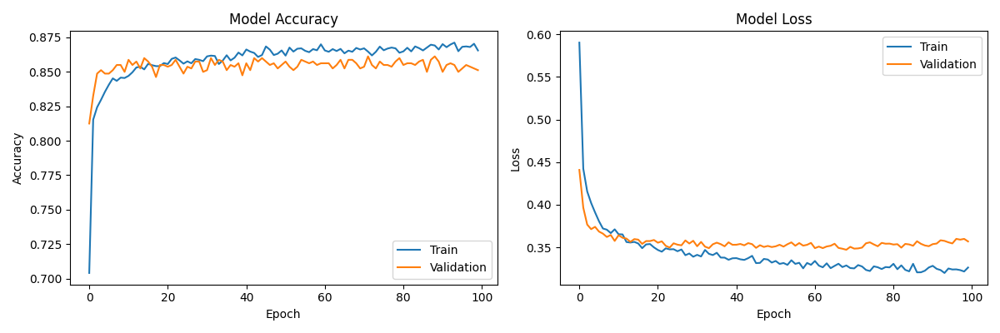

# Bank Customer Churn Predictor — ANN

    

A deep learning project that predicts whether a bank customer is likely to churn (leave the bank), using an Artificial Neural Network (ANN) built with TensorFlow and Keras. The model is trained on the Kaggle Churn Modelling dataset of 10,000 customers and includes thorough exploratory data analysis before modelling.

Built as part of my hands-on ML portfolio while transitioning from IT production support into AI/ML engineering.

---

## Problem Statement

Customer churn is one of the most expensive problems in banking. Acquiring a new customer costs 5–7x more than retaining an existing one. This project builds a neural network that identifies at-risk customers based on their profile — giving banks the chance to intervene before losing them.

---

## Demo

### Training Accuracy & Loss Curves


> Accuracy and loss curves across 100 epochs — both train and validation curves tracked to monitor overfitting.

---

## Project Structure

```
BankChurnPredictor/
│
├── Churn_Modelling.csv           # Kaggle dataset (10,000 customers)
├── BankChurnPredictor.ipynb      # Full notebook — EDA + model training + evaluation
├── BankChurnPredictor.keras      # Saved trained ANN model
├── scaler.pkl                    # Saved StandardScaler (required for predictions)
├── training_history.png          # Accuracy & loss plot output
├── requirements.txt              # Dependencies
└── README.md
```

---

## Dataset

- **Source:** [Churn Modelling Dataset](https://www.kaggle.com/datasets/shubh0799/churn-modelling) on Kaggle
- **Rows:** 10,000 customer records
- **Features:** Credit score, geography, gender, age, tenure, balance, number of products, credit card status, active membership, estimated salary
- **Target variable:** `Exited` — 1 (churned) or 0 (stayed)
- **Class split:** ~20% churned, ~80% retained

---

## Exploratory Data Analysis

Before building the model, a thorough EDA was performed to understand which features drive churn:

| Plot | What It Shows |
|------|---------------|
| Countplot — Exited | Class imbalance between churned and retained customers |
| Histplot — Age by Exited | Age distribution of churners vs retained customers |
| Boxplot — CreditScore by Exited | Whether credit score differs between groups |
| Countplot — Gender by Exited | Gender-wise churn comparison |
| Histplot — Balance by Exited | How account balance relates to churn |
| Barplot — NumOfProducts by Exited | Effect of number of products on churn rate |
| Heatmap — Correlation Matrix | Feature correlations with annotated values |

---

## Preprocessing Steps

1. **Dropped** non-informative columns: `RowNumber`, `CustomerId`, `Surname`
2. **Label encoded** `Gender` (Male=1, Female=0) using `LabelEncoder`
3. **One-hot encoded** `Geography` using `pd.get_dummies()` with `drop_first=True` to avoid multicollinearity
4. **Converted** boolean dummy columns (`Geography_Germany`, `Geography_Spain`) to integer type explicitly
5. **Train/test split** — 80/20 with `random_state=45`
6. **Feature scaling** — `StandardScaler` fitted only on training data, applied to both train and test (to prevent data leakage)

---

## Model Architecture

```
Input Layer          →  11 features
Hidden Layer 1       →  64 neurons, ReLU activation
BatchNormalization   →  Normalises activations between layers
Dropout (0.2)        →  Drops 20% of neurons to reduce overfitting
Hidden Layer 2       →  32 neurons, ReLU activation
BatchNormalization   →  Normalises activations between layers
Dropout (0.2)        →  Drops 20% of neurons to reduce overfitting
Output Layer         →  1 neuron, Sigmoid activation
```

| Parameter | Value |
|-----------|-------|
| Optimizer | Adam |
| Loss Function | Binary Crossentropy |
| Epochs | 100 |
| Batch Size | 32 |
| Validation Split | 10% |

**Key design choices:**
- **BatchNormalization** — normalises the output of each layer before passing to the next. This stabilises and speeds up training, and reduces sensitivity to weight initialisation. Added after each hidden layer.
- **Dropout (0.2)** — randomly disables 20% of neurons during each training step to prevent the model from over-relying on specific neurons
- **ReLU** — fast, avoids vanishing gradient, standard for hidden layers in deep learning
- **Sigmoid** — squishes output to a 0–1 probability range, ideal for binary classification

---

## Training & Evaluation

```python
trained_mod = model.fit(
    x_train, y_train,
    epochs=100,
    batch_size=32,
    validation_split=0.1
)
```

Predictions are made by applying a 0.5 threshold to the model's output probabilities:

```python
y_pred = model.predict(x_test)
y_pred = (y_pred > 0.5).astype(int)
```

---

## Results

| Metric | Score |
|--------|-------|
| Test Accuracy | ~86% |
| Precision (Churn=1) | ~0.74 |
| Recall (Churn=1) | ~0.50 |
| F1-Score (Churn=1) | ~0.60 |

> Update these numbers with your actual output after running the notebook.

---

## How to Run

**1. Clone the repository**
```bash
git clone https://github.com/your-username/BankChurnPredictor.git
cd BankChurnPredictor
```

**2. Install dependencies**
```bash
pip install -r requirements.txt
```

**3. Download the dataset**

Download `Churn_Modelling.csv` from [Kaggle](https://www.kaggle.com/datasets/shubh0799/churn-modelling) and place it in the project root folder.

**4. Run the notebook**
```bash
jupyter notebook BankChurnPredictor.ipynb
```

**5. Load and use the saved model**
```python
import joblib
import numpy as np
from tensorflow import keras

model     = keras.models.load_model('BankChurnPredictor.keras')
std_sclr  = joblib.load('scaler.pkl')

# [CreditScore, Gender, Age, Tenure, Balance,
#  NumOfProducts, HasCrCard, IsActiveMember,
#  EstimatedSalary, Geography_Germany, Geography_Spain]
new_customer = [[600, 1, 40, 3, 60000, 2, 1, 1, 50000, 0, 1]]
prob = model.predict(std_sclr.transform(new_customer))[0][0]
print(f"Churn probability: {prob:.2%}")
```

---

## Requirements

```
tensorflow>=2.10
pandas>=1.5
scikit-learn>=1.3
matplotlib>=3.6
seaborn>=0.12
joblib>=1.2
numpy>=1.23
```

---

## What I Learned

- Performing exploratory data analysis with 7 different visualisations before modelling
- Why `BatchNormalization` stabilises ANN training and how it differs from `Dropout`
- How to correctly apply `StandardScaler` after the train/test split to prevent data leakage
- The difference between `label encoding` (binary columns) and `one-hot encoding` (multi-category columns like Geography)
- How to convert boolean dummy columns to integers explicitly for clean model input
- Interpreting precision vs recall trade-offs in imbalanced binary classification

---

## Future Improvements

- [ ] Address class imbalance using SMOTE oversampling or `class_weight` in model training
- [ ] Tune the decision threshold from 0.5 to improve recall on the churn class
- [ ] Try deeper architectures and compare performance with and without BatchNormalization
- [ ] Add hyperparameter tuning using Keras Tuner
- [ ] Build a Streamlit app for live single-customer churn prediction
- [ ] Explore SHAP values to explain individual model predictions

---

## About Me

I'm an IT production support professional with 4 years of mainframe experience, actively building an AI/ML portfolio as I transition into machine learning engineering. This is part of a series of projects to demonstrate real, hands-on ML skills.

- LinkedIn: [your-linkedin-url]
- GitHub: [your-github-url]

---

## License

This project is licensed under the MIT License. The Churn Modelling dataset is publicly available on Kaggle for educational use.
